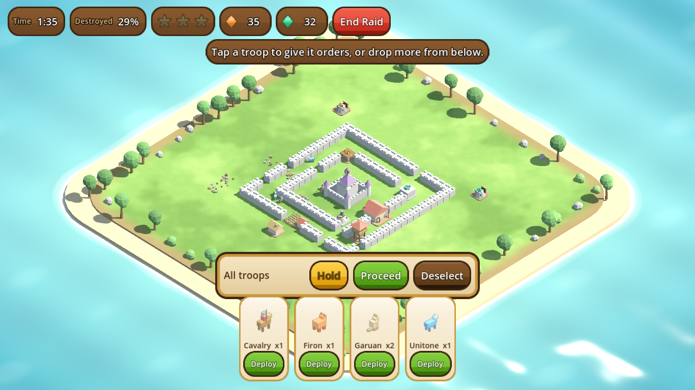
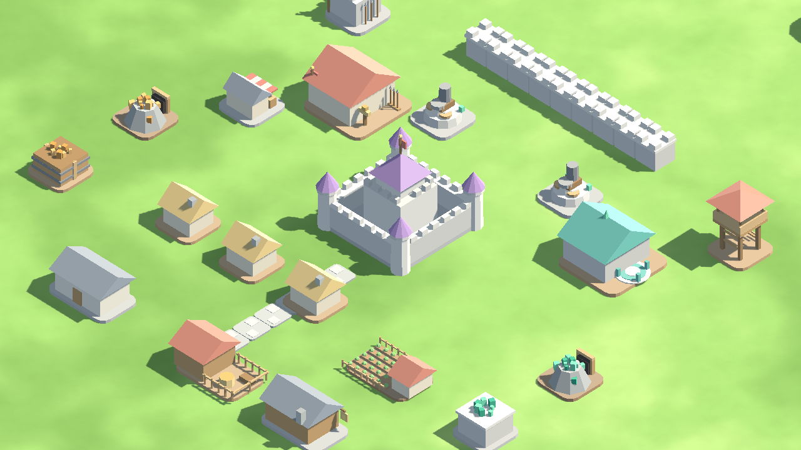

# Nivi

A kingdom builder in the spirit of Clash of Clans: raise a base on your island,
mine Serge and Jade, train soldiers and creatures, then lead a raid on your
neighbours in person.

Built in **Godot 4.3** as a native game. It runs in 3D with an isometric
camera you can turn, so the buildings have real volume and cast real shadows,
and a first-person view through the King's own eyes for walking the streets
or leading a raid from the front.






## Running it

Install [Godot 4.3](https://godotengine.org/download) (the standard build, no
C# needed), then either:

- open Godot, press **Import**, pick this folder's `project.godot`, and hit **Play**; or
- from a terminal: `godot --path .`

The first launch imports the project, which takes a few seconds. Your kingdom
saves itself to Godot's user data folder and reloads when you return, crediting
up to two hours of mining you missed while away.

To export a standalone build, install the export templates in Godot
(**Editor, Manage Export Templates**) and use **Project, Export**. Presets for
Windows, Linux, macOS and Android are already set up in `export_presets.cfg`.

## Controls

| Action | Input |
| --- | --- |
| Pan | Drag with a mouse, one finger or one touchpad finger, or `W` `A` `S` `D` / arrow keys |
| Zoom | Scroll wheel, pinch (touchpad or touchscreen), or hold `Q` to zoom in / `E` to zoom out |
| Turn the view | Hold **< Turn** / **Turn >**, hold `Z` / `X`, or drag with the right mouse button |
| Inspect a building | Tap it. A light tap never nudges the camera first, so it always hits what is under it |
| Collect a full mine | Tap it again, or press **Collect** |
| Build (most buildings) | **Build**, choose a building, drag it into place, press **Place** |
| Lay walls or roads | **Build**, choose Wall or Road, then press and drag across the ground in any direction — every tile the drag crosses is placed on the spot, Clash-of-Clans style. Press **Done** when finished |
| Cancel | `Esc`, or **Cancel** / **Done** |
| Open the shop | `B` |
| Collect everything | `C` |
| Walk as the King | **Walk**, or `K`. `W` `A` `S` `D` / arrows or the on-screen stick move him; the camera follows. `Esc` or **Stop walking** ends it |
| Throw a Nivian ball | **Throw**, `Space`, or tap the wild Nivian, once you are close to one in the forest |
| First person | **First person**, or `V`, in the kingdom or on a raid once the King is deployed. Drag or hold `Q` / `E` to look around; `W` `A` `S` `D` walk the way you face |
| Ride a Nivian | **Ride**, or `R`, while walking: climbs onto the next of the King's Nivians, or back down after the last |

A touchpad's two-finger scroll and pinch gestures pan and zoom directly, so a
trackpad doesn't have to be driven like a mouse. On a real touchscreen, one
finger drags and taps, two fingers pan and pinch-zoom together.

In a raid there is nothing to deploy: everyone who came, the King included,
is already drawn up on the flagstone muster ground at the mouth of the
mountain pass when you arrive, and nobody moves until told. Use a staging
card's **-** and **+** to pick how many of that type join the next order,
then tap a building to send exactly that squad at it. A soldier's Nivians
go as part of them: a Unitone carries its soldier and takes the first blows
(if it falls, the rider fights on afoot), while a Firon or Garuan walks at
their soldier's side and strikes whatever the soldier strikes, never off on
its own. Tap an already-committed troop to select it alone, then **Hold**
pauses it and **Proceed** resumes it. Tap the King and tap the ground to
walk him, or switch to first person and lead from the front.

The kingdom sits on a plateau in a valley walled by mountains; the forest
is the wood just south of it, down a dirt lane. Wild Nivians wander its
meadow; a caught one is replaced after a while, so it never runs dry. The
King bonds no Nivians by decree: walk him down and throw a Nivian ball at
one from a few steps away. The closer you stand, the better it
sticks; a miss sends the Nivian bolting. He keeps up to five, and once he is
full a catch goes to any soldier short of their two. Firon will not bond
with a ruler under twenty credits. Soldiers make the same trip on their own:
a Nivian lost in a raid sends its soldier to the forest for a while, and they
come back with another.

**First person** puts you behind the King's eyes, in the kingdom and in a
raid alike. In the kingdom he walks wherever he likes and can ride any of
his Nivians (a Unitone is the fastest); in a raid he goes where you walk
him and strikes whatever comes within reach, while the rest of the army
keeps to its squad orders. Switch back to the isometric view at any time.
Townsfolk are out in the streets with their Nivians trailing behind them,
and they keep strictly to the roads you lay; with no roads they gather in
the square before the Castle. Only the King goes wherever he pleases.

## What is in the game

Everything the design document lists for Castle Level One, section 5:

| System | What it does |
| --- | --- |
| **Castle** | The seat of the throne and a bunker. Carries the base storage and shelters citizens. The upgrade to Castle Two is deliberately locked. |
| **Barracks H** | Enlists citizens as Knights and Cavalry. Nivians are never trained separately -- each new soldier automatically bonds two, drawn from Unitone, Firon and Garuan. |
| **Serge and Jade mines, and their stores** | Mines fill over time and are tapped to collect. Stores raise the ceiling. Jade mines run a little faster than Serge, to offset how many buildings draw on Serge. |
| **Support buildings** | Homes, farms, shops, taverns, hospital, roads and walls, all now costing a mix of Serge and Jade rather than leaning on one currency. |
| **Military stationing** | Guard Stations and Outposts house the army; the Law Enforcer Ground Cavalry Outpost houses cavalry alone. |
| **The valley** | A plateau ten times the buildable area of the original plot, on open land ringed by mountains, with the forest just south of the walls. A raid map is the same: the enemy's valley, entered through a mountain pass. |
| **Short-Fire Cannon** | The single Castle One defence: short range, fast rate of fire. |
| **First person and the streets** | A perspective camera at the King's eyes, in the kingdom and in raids; mounting his Nivians; and townsfolk who walk the roads, and only the roads, with their Nivians in tow. |
| **The forest** | The wood south of the kingdom, where wild Nivians roam. The King catches his own in person, on foot with a Nivian ball; soldiers who lose one in a raid go and bond another off-screen. |
| **Nivians in a raid** | A Unitone is ridden: its speed becomes its rider's and it takes the first blows. A Firon or Garuan walks at its soldier's side and fights what the soldier fights. No Nivian is ever a unit on its own. The King's are the same. |
| **Population and bonding** | Citizens take jobs from your buildings, age each season, are born when there is room, and die of old age. Every citizen bonds one Nivian, rarely two; a soldier bonds exactly two, who fight only when that soldier is sent into battle, never trained or sent in on their own; the King can bond up to five. Up to 15 soldiers total. |
| **Creatures** | Stats derive from the placeholder Normal, Fire and Water ratios and the three sample creatures in section 7. Modelled as proper beasts: the Unitone a water-horse with a streaming mane, the Firon a bear of ember and hide, the Garuan an upright kangaroo-like hopper with a heavy tail. |
| **Credits** | Festivals and taxes move happiness and karma. Firon only bonds with a ruler holding twenty credits or more. |
| **Raids** | Three enemy kingdoms with procedurally arranged bases. The army musters at the mountain pass and waits until a squad command sends a chosen number of them, with their Nivians, at a chosen building; nobody attacks unordered. Troops route around walls or break through them, and answer your orders mid-fight. Stars come from half the base, the enemy Castle, and a clean sweep. |
| **Consequence** | Soldiers who fall may be lost for good, taking their citizen with them. The rest are injured and recover, far faster once a Hospital stands. |

Left for later milestones, as the document recommends: Magic Circles,
Commanders, the other six regions, multiplayer and character creation.

## Sound

The soundtrack and every effect are synthesised in code at startup, so the game
still ships without a single audio file.

Two tracks loop under the game and cross-fade when you leave home or return: a
calm one in the kingdom, built on a warm pad, a plucked arpeggio and a simple
tune, and a driving one for raids with a pounding bass and a kit. Each is
rendered on a worker thread while the game is already on screen, and the join
is seamless because whatever is still ringing at the end of the loop is folded
back onto the start.

Seventeen effects cover the interface, the kingdom and the battlefield: clicks
and panel whooshes, a refusal buzz, the thud of a building set down, a chime
when one finishes, coins on collection, hammer on anvil, troops dropping in,
steel, creature bolts, the cannon, buildings collapsing, a star earned, and a
fanfare or a lament at the end of a raid. They play through a pool of voices so
overlapping sounds never cut each other off, and the busy battlefield ones are
thinned out so a hundred sword strikes a second do not turn to mush.

Music and sound have separate mixer buses and separate switches under **Menu**,
remembered between sessions in `user://nivi_settings.cfg`.

Samples of the result are in `docs/`: `music_kingdom.wav`, `music_raid.wav` and
`sound-effects.wav`.

## How the project is laid out

```
project.godot            Godot project file: open this folder in the editor
scenes/Main.tscn         Entry scene; everything else is built in code
scripts/Config.gd        All game data: buildings, units, creature ratios, enemy kingdoms
scripts/Game.gd          The kingdom: state, the clock, saving and loading
scripts/Main.gd          Application root; swaps between the base and a raid
scripts/art/MeshBuilder  Builds low-poly models from coloured primitives
scripts/art/Palette.gd   One shared colour palette
scripts/art/Buildings.gd A model for every Castle One building
scripts/art/Troops.gd    Models for soldiers, creatures and the King
scripts/world/Island.gd  A grass plateau, the valley floor and its ring of mountains
scripts/world/Forest.gd  The forest south of the kingdom and the wild Nivians
scripts/world/FirstPersonCam.gd  The King's eyes: a perspective camera for both scenes
scripts/world/Townsfolk.gd  Citizens and their Nivians walking the roads
scripts/world/BaseWorld  Your kingdom in 3D: placement, selection, collection
scripts/world/CameraRig  Isometric camera: pan, zoom, turn, tap
scripts/world/WorldEnv   Sun, sky and shadow settings shared by both scenes
scripts/battle/BattleState  Raid logic: enemy bases, troop AI, cannons, loot
scripts/battle/BattleWorld  The raid, drawn
scripts/ui/UiTheme.gd    The wood-and-gold interface theme, generated at startup
scripts/ui/Hud.gd        Resource bars, build menu, panels and windows
scripts/ui/BattleHud.gd  The raid interface
scripts/ui/Thumb.gd      Live 3D previews for the menu cards
scripts/audio/Synth.gd   A small software synthesiser: oscillators and envelopes
scripts/audio/Sfx.gd     Every sound effect, rendered at startup, plus the settings
scripts/audio/Music.gd   The two looping tracks, composed and rendered on a thread
scripts/Capture.gd       Development helper: render a frame, or simulate a raid
shaders/                 Grass
```

## Tuning

Every number lives in `scripts/Config.gd` and matches the design document's
placeholder values. Costs, timers, hitpoints, damage, production rates, enemy
kingdoms and decree effects can all be changed there without touching game
logic. Adding a building means adding an entry to `BUILDINGS` and a model
function in `scripts/art/Buildings.gd`.

There are no image or model files: every model, texture and interface panel is
generated in code at startup, which keeps the repository small and makes the
art easy to adjust.

## Checking your work without a desktop

`scripts/Capture.gd` reads command line arguments after `--`:

```bash
# render one frame of the game to a file
godot --path . -- --capture=/tmp/shot.png --after=60

# open a particular screen first
godot --path . -- --capture=/tmp/shot.png --after=90 --demo=build

# play a whole raid with no window and print what happened
godot --headless --path . -- --after=30 --demo=sim

# check the staging area / squad orders, and the forest / catching, headlessly
godot --headless --path . -- --after=30 --demo=squad
godot --headless --path . -- --after=30 --demo=catch
godot --headless --path . -- --after=30 --demo=view

# write every sound to /tmp/nivi_audio so it can be listened to
godot --headless --path . -- --after=30 --demo=audio
```
