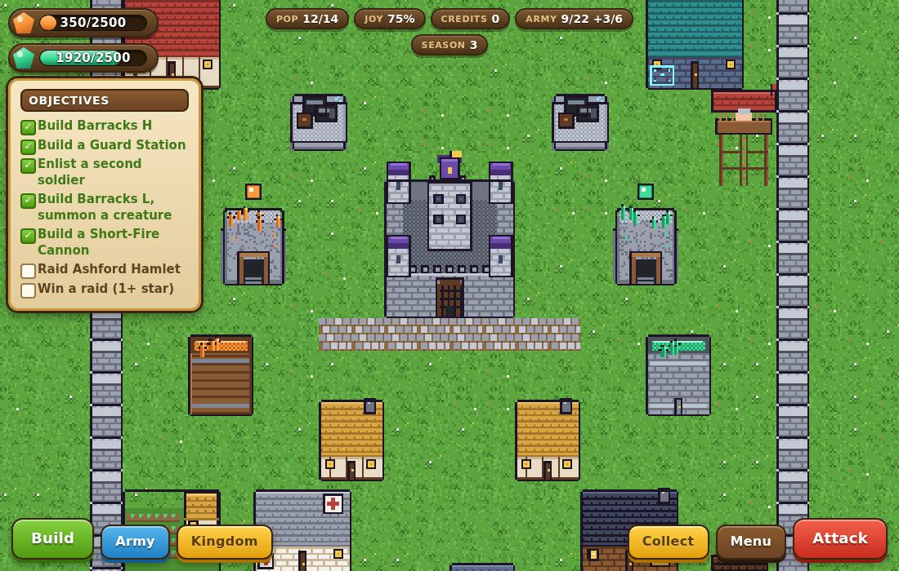
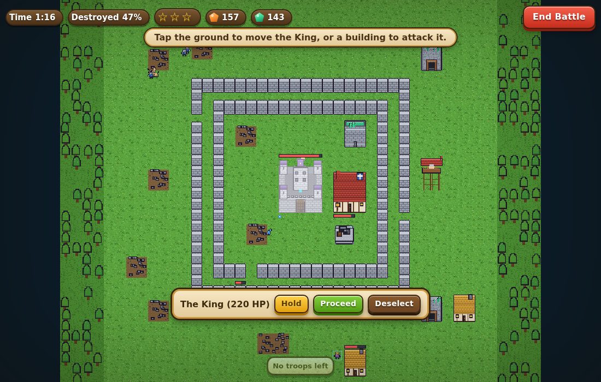

# Nivi · Castle Level One

A 2D pixel-art kingdom-builder with a Clash of Clans style interface, built as
the first playable milestone described in the project's game design document:
**top-down base building, Castle Level One only**, running in the browser with
no build step.

The world is pixel art; the UI around it is the familiar wood-and-gold game
interface: rounded resource bars with gem icons, chunky 3D buttons, and
parchment windows with gold frames.





## Running it

```bash
npm start          # serves the game at http://localhost:8080
npm test           # headless tests for the simulation and battle rules
```

Any static file server works (ES modules need `http://`, not `file://`), e.g.
`python3 -m http.server 8080`.

Progress is saved automatically in the browser's local storage, including
offline production while the tab is closed (capped at two hours).

## What's in the demo

Everything the GDD lists for Castle Level One (section 5 and 17.1):

| System | Implementation |
| --- | --- |
| **Castle** | Pre-built seat of the throne. Holds base storage, shelters citizens. Upgrade button is locked (Castle 2 is out of scope). |
| **Barracks H / L** | Two separate training queues. H enlists citizens as Knights and Cavalry, L summons Unitone, Firon and Garuan. |
| **Serge & Jade Mines + Storage** | Mines tick up over time, fill up, and are collected by tapping. Storages raise the caps. |
| **Support buildings** | Homes (population), Farms, Shops, Taverns (happiness and professions), Hospital (faster healing), Roads, Walls. |
| **Military stationing** | Guard Stations and Outposts house the army; the Law Enforcer Ground Cavalry Outpost houses cavalry only. |
| **Short-Fire Cannon** | The single Castle 1 defense: short range, fast rate of fire. |
| **Population** | Citizens take professions from your buildings, age each season, are born when there's room and can die of old age. Civilians bond 1 creature, soldiers 2, the King 5 (section 6). |
| **Creatures** | Stats derived from the placeholder type ratios (Normal / Fire / Water) and the three sample creatures in section 7. |
| **Credits (karma)** | Decrees (festival, taxes) move happiness and credits. Firon only bonds with a ruler holding 20+ credits. |
| **Attack mode** | The "arm-guard hologram": pick one of three story kingdoms, deploy troops by tapping, and direct them live: select a troop, focus a building, hold, proceed. The King is deployed and moved by hand. Rule-based troop AI, A* routing around or through walls. |
| **Life & death** | Soldiers who fall may die permanently (they leave the population too); the rest are injured and recover, faster with a Hospital. |

Deferred to later milestones, as the GDD recommends: first-person combat,
Magic Circle techniques, Commanders, the other six regions, multiplayer,
character creation.

## Project layout

```
index.html        page shell and HUD markup
styles.css        Clash of Clans style UI: wood, gold, parchment, 3D buttons
server.js         zero-dependency static server
src/config.js     all game data: buildings, units, creature ratios, kingdoms (placeholder numbers)
src/state.js      new game, grid helpers, save/load
src/sim.js        economy, construction, training, population, healing, decrees
src/battle.js     enemy base generation, troop AI, cannons, loot and stars
src/pathfind.js   A* on the tile grid (walls are costly, buildings block)
src/pixel.js      tiny pixel-canvas helper + seeded RNG
src/sprites.js    every sprite, drawn procedurally at 1:1 pixel scale
src/renderer.js   camera and canvas drawing (depth-sorted, crisp scaling)
src/input.js      pan / pinch / wheel / tap / keyboard
src/ui.js         HUD, build menu, panels, battle overlay, results
src/main.js       game loop and controller
test/             node:test suites (no browser needed)
```

## Tuning

All numbers live in `src/config.js` and mirror the GDD's placeholder values.
Costs, timers, HP, damage, production rates, enemy kingdoms and decree effects
can all be changed there without touching game logic. Adding a building means
adding an entry to `BUILDINGS` and a draw function in `src/sprites.js`.

## Controls

- Drag to pan, scroll or pinch to zoom, `WASD` / arrows also pan.
- Tap a building to inspect it; tap a full mine to collect.
- `B` opens the build menu, `C` collects everything, `Esc` / right-click cancels.
- In battle: pick a troop type, tap the ground to deploy; tap a troop to select it, tap a building to focus it.
